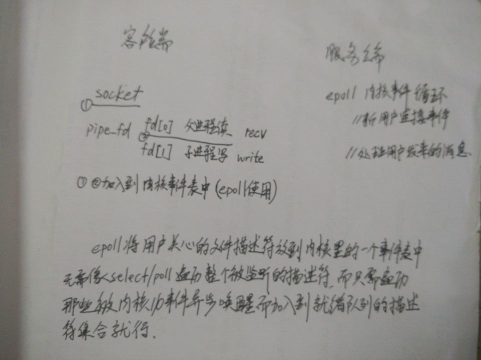

# epoll 相关结构体和函数

* epoll用到的所有函数都是在头文件sys/epoll.h中声明的
```
typedef union epoll_data {  
    void ptr;  
    int fd;  
    __uint32_t u32;  
    __uint64_t u64;  
} epoll_data_t;  
  
struct epoll_event {  
    __uint32_t events;    / Epoll events /  
    epoll_data_t data;    / User data variable /  
};  
```
* epoll 三个函数

```
int epoll_create(int size)
创建一个epoll句柄，参数size用来告诉内核监听的数目，size为epoll所支持的最大句柄数
```

```
int epoll_ctl(int epfd, int op, int fd, struct epoll_event *event)
函数功能： 用于控制某个文件描述符上的事件，可以注册事件，修改事件，删除事件。

参数epfd为epoll的句柄，即 epoll_create 函数返回值
参数op表示动作，用3个宏来表示：  
    EPOLL_CTL_ADD(注册新的fd到epfd)， 
    EPOLL_CTL_MOD(修改已经注册的fd的监听事件)，
    EPOLL_CTL_DEL(从epfd删除一个fd)；
其中参数fd为需要监听的标示符；
参数event告诉内核需要监听的事件
```

```
int epoll_wait(int epfd, struct epoll_event * events, int maxevents, int timeout)
该函数用于轮询I/O事件的发生；

epfd:由epoll_create 生成的epoll专用的文件描述符；
epoll_event:用于回传代处理事件的数组；
maxevents:每次能处理的事件数；
timeout:等待I/O事件发生的超时值（ms）；-1永不超时，直到有事件产生才触发，0立即返回。

该函数返回发生事件数。-1有错误。
```

参考

https://www.shiyanlou.com/courses/315/labs/981/document

http://blog.csdn.net/wangpengqi/article/details/9933011

-----

# epoll使用 见code目录下的源码
结构设计如下图




* fcntl函数（对(文件)描述符提供控制）详解

http://blog.csdn.net/pbymw8iwm/article/details/7974789

* linux socket编程的相关函数

http://www.cnblogs.com/xuxm2007/archive/2011/08/18/2144976.html

```
socket, bind, listen, accept, read write
connect recv, recvfrom, sendto
```

* socket结构体
```
include <netinet/in.h>

struct sockaddr {
    unsigned short    sa_family;    // 2 bytes address family, AF_xxx
    char              sa_data[14];     // 14 bytes of protocol address
};

// IPv4 AF_INET sockets:

struct sockaddr_in {
    short            sin_family;       // 2 bytes e.g. AF_INET, AF_INET6
    unsigned short   sin_port;    // 2 bytes e.g. htons(3490)
    struct in_addr   sin_addr;     // 4 bytes see struct in_addr, below
    char             sin_zero[8];     // 8 bytes zero this if you want to
};

struct in_addr {
    unsigned long s_addr;          // 4 bytes load with inet_pton()
};
```
